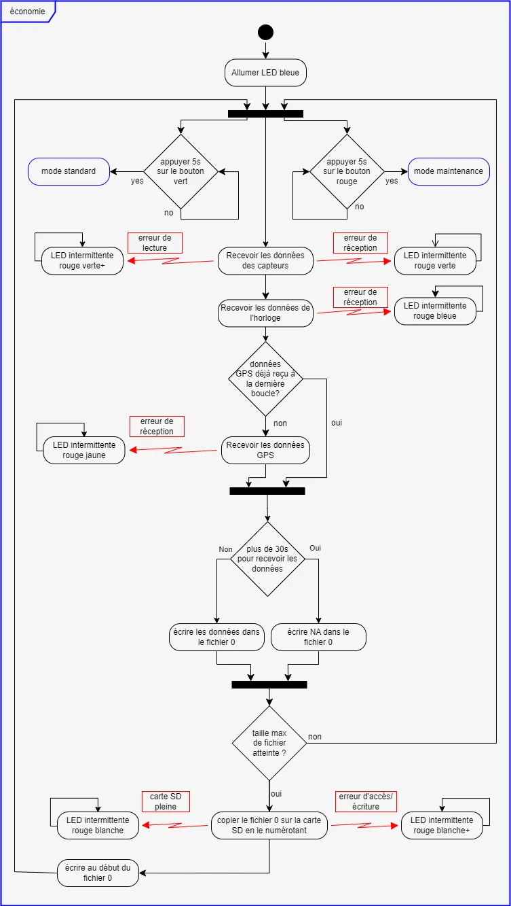
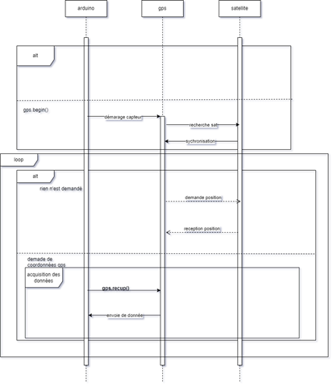

    <h1>
        Station Météo
    </h1>

Maquettage d'une station météo sur Arduino permettant l'enregistrement sur une carte SD de paramètres météorologiques comme la température, la luminosité ou la position GPS.

---

# Sommaire

- [Sommaire](#sommaire)
- [Contexte](#contexte)
- [Conception](#conception)
  - [Diagramme d'activité](#diagramme-dactivité)
  - [Diagramme de cas d'utilisation](#diagramme-de-cas-dutilisation)
  - [Diagramme de composants](#diagramme-de-composants)
  - [Diagramme d'état](#diagramme-détat)
  - [Diagramme de séquences](#diagramme-de-séquences)
- [Photos](#photos)

# Contexte

Le projet World Weather Watcher a été entrepris par l'Agence Internationale pour la Vigilance Météorologique (AIVM).  

Il consiste à concevoir et déployer dans les océans des navires de surveillance équipés de stations météo embarquées chargées de mesurer les paramètres influant sur la formation de cyclones ou autres catastrophes naturelles. 

Notre startup a été embauchée pour la création d’un prototype. 

La conception de ce dispositif doit prendre en compte divers besoins et contraintes, comme la nécessité de rendre l’utilisation accessible à tous, et de résister à son environnement. Ce projet étant de grande envergure, notre solution se doit d’être irréprochable.  

# Conception

## Diagramme d'activité

Nous avons ensuite décider d’utiliser un diagramme d’activité de manière à pouvoir poser les bases de notre code et le planifier avant de l’implémenter dans les différents langages que nous utiliserons. 

Ainsi nous pouvons avoir une vue technique de la station météo, et plus particulièrement de la manière dont les fonctionnalités demander seront misent en place dans le programme. 

Tout d’abord, lors du lancement de la station, deux branches se créent. 
Si le bouton rouge est appuyé au moment même du démarrage, le mode configuration est activé. 
Au contraire, si le bouton n’est pas pressé, la station se lance d’elle-même en mode standard. 

Lorsque la station est lancée en mode configuration, la LED s’allume en jaune. 
Le port série est initialiser pour pouvoir échanger des informations avec l’utilisateur. 
L’utilisateur peut ensuite régler les différents paramètres de la station via des commande qu’il entre dans le moniteur série. Il peut aussi choisir l’option reset, qui remet les paramètres à leurs valeurs par défauts. 

Une fois tous les paramètres entrés, ils sont enregistrés dans l’EEPROM. 
La station quitte automatiquement le mode configuration au bout de 30min sans activité, elle passe alors en mode de fonctionnement standard. 

Lorsque la station entre en mode standard, la LED passe en vert. 

Quand la station est en mode standard, elle reçoit les données des capteurs toutes les 10min (elle boucle donc à la condition tant que celle-ci n’est pas validé). 
Nous avons symbolisé les erreurs possibles par des exceptions lors de l’acquisition des données. Ainsi, la LED passe dans différents états en fonction de l’erreur rencontré. (Le + suivant une couleur signifie que celle-ci à une durée plus longue que l’autre dans l’intermittence). 

Si les données sont incohérentes ou que l’horloge ou le GPS est inaccessible, la station reste bloquée en état d’erreur jusqu’à ce qu’elle soit redémarrée ou que le mode ne soit changé. 

Dans le cas où le temps maximum pour l’acquisition des données des capteurs est dépassé deux fois d’affiler, la station écrit NA aux données des capteurs dans le fichier, puis fait clignoter la LED pour signifier l’erreur. 

Une fois les données prête à être écrite, la station vérifie si le fichier 0 n’a pas excédé la taille maximum indiquée. 

Dans le cas où la taille maximale n’est pas dépassée, la station écrit les données en bas du fichier 0, puis le une nouvelle boucle du mode standard se lance. 

Si la taille maximale est atteinte, la station copie d’abord le fichier 0 dans la carte SD en me numérotant. Puis elle écrase les données dans le fichier 0 en repartant en haut de celui-ci. Une fois cette opération effectuée, une nouvelle boucle du mode standard se lance. 

Dans le cas où la carte ne peut pas écrire sur la carte SD ou que celle-ci est pleine, elle entre en phase d’erreur. 

Le mode standard peut être quitter à tout moment grâce à une interruption.  
Soit en appuyant 5 secondes sur le bouton rouge, ce qui active le mode maintenance. 
Soit en appuyant 5 secondes sur le bouton vert, ce qui active le mode écologique. 

Le mode économie regroupe les mêmes fonctionnalités que le mode standard, à deux exceptions près. Il allume la LED en bleue 

L’intervalle de capture des données est multiplié par deux et les données GPS ne sont enregistrés que lors d’une itération de la fonction sur deux. 

Lorsque le mode maintenance s’active, la LED s’allume en orange. 

Le mode maintenance étant une boucle, puisqu’il n’inclut pas d’acquisition de données des capteurs, celles-ci sont stoppées. 

Le mode maintenance active également le port série par lequel il communique les données en direct pour qu’elles soient lisible par l’utilisateur. 

## Diagramme de cas d'utilisation

Afin de définir les différentes utilisations de notre station météo, nous avons réalisé un diagramme de cas d’utilisation. Nous y avons défini 5 fonctions accessibles à l’utilisateur : Enlever la carte SD, Visualiser les données, effectuer une maintenance, changer le mode fonctionnement et configurer les capteurs. La station météo interagit également avec des utilisateurs secondaires : les capteurs (intégrés dans la station météo) et les satellites fournissant des données GPS. 

Afin de pouvoir synthétiser le mode de fonctionnement de notre station, et ainsi de mieux inclure les besoins du client dans celle-ci, nous avons utilisé un diagramme de cas d’utilisation (use case). 

Ce diagramme représente les relations qu’ont les acteurs, humain ou non, avec le système (en l’occurrence, la station météo). 

Le système interagi avec 2 acteurs non-humains : 

Les capteurs, qui permettent l’acquisition des données 

Le satellite qui permet d’acquérir la position via le GPS 

Enregistrement des données est une extension de leur acquisition car il est possible d’acquérir les données sans les enregistrer. (Comme dans le mode maintenance). 

Un utilisateur humain peut quant-à-lui effectuer 5 actions différentes : 

Configurer les capteurs. Cette action inclue de d’abord entrer en mode configuration. 

Changer le mode de fonctionnement de la station. Ainsi il a le choix de la passer soit en mode économie, soit en mode configuration. 

Effectuer une maintenance. Pour cela il doit d’abord changer le mode de fonctionnement de la station pour la passer en mode maintenance. 

Visualiser les données. Cela inclue d’abord de passer la station en mode maintenance, pour qu’elle envoie les données vers le port série afin qu’elle soit lu. Cette action est aussi une extension de l’enregistrement des données car elle permet aussi de visualiser les données présente sur la carte SD. 

Enlever la carte SD. Qui inclue d’effectuer une maintenance, puisque le mode maintenance sécurise l’extraction de la carte. Cette action est une extension de la visualisation des données puisqu’elle nécessite aussi d’activer le mode maintenance.

## Diagramme de composants

Afin de pouvoir étudier la structure du système, nous venons identifier les différents points de liaison des capteurs et du microcontrôleur Arduino. 

Afin de simplifier le branchement, nous allons regroupé par protocole de transmission les différents périphériques reliés à la carte Arduino : 

On y retrouve l’horloge RTC et les capteurs I2C au bus I2C certains capteurs ne seront dans un premier temps qu’en partie intégré. 

Nous retrouvons ensuite le lecteur de carte SD qui sera relier sur un bus SPI.  

Puis le GPS qui lui est placé sur un protocole UART 

Le capteur de luminosité qui est branché sur les broches analogiques  

Enfin, les boutons rouge et vert, la LED RGB et le capteur de particules fines sont relié en 2-wire avec plus précisément les boutons qui seront sur les broches d’interruption (broche 0 à 5) pour les deux autres, ils seront branchés sur les broches classiques. 

## Diagramme d'état

Un diagramme d'états-transitions est un type de diagramme comportemental en langage de modélisation unifié (UML) qui représente les transitions entre divers objets.

Un automate désigne tout appareil qui enregistre l'état d’un objet à un moment donné et peut changer l'état ou provoquer d'autres actions selon les informations qu’il reçoit. Les états correspondent aux différentes combinaisons d'informations qu'un objet peut contenir et non la façon dont celui-ci se comporte.

Pour commencer, le diagramme démarre avec un rond noir pour marquer le début, avec des rectangles aux coins arrondis qui marquent la nature ou l’état actuelle de l’objet.
On peut voir que dans le rectangle marqué en rouge, on débute logiquement par la fonction « démarrer le système », ensuite on place un losange pour marquer que le prochain état est variable, car dans notre cas selon avoir pressé le bouton rouge ou non le système ne va pas avoir le même état.
On a alors deux états :
-	Bouton rouge pressé, qui va activer le mode configuration
-	Bouton rouge non pressé, qui va activer le mode standard.

Comme indiqué précédemment, en pressant le bouton rouge le système s’active en mode configuration.
 On voit dans le rectangle encadré en rouge que ce mode a deux états :
 -si l’utilisateur ne l’utilise pas pendant 30 minutes le système rebascule en mode standard
 - L’utilisateur peut configurer les paramètres du système
Sinon, l’utilisateur peut éteindre le système.

Pour continuer, après avoir activer le mode standard, on peut consulter les données, sinon on peut activer deux autres modes :
-	Mode économique, en appuyant 5 secondes sur le bouton vert
-	 Mode Maintenance, en appuyant 5 secondes sur le bouton rouge
En activant le mode économique, on peut sois désactiver certains capteurs pour l’économie d’énergie, ou sois basculer en mode standard ou maintenant en appuyant 5 secondes sur le bouton rouge.
En activant le mode maintenance, on peut sois accéder aux données et changer la carte SD, ou sois basculer dans le mode précédant en appuyant 5 secondes sur le bouton rouge.
 
Pour finir, à partir de tous les modes on peut éteindre la station :

## Diagramme de séquences

Nous allons maintenant venir nous interroger sur la réalisation et la communication des différentes parties de façon séquentiel.
En effet, nous allons ici nous pencher sur chaque sous-ensemble et comment ces derniers interagissent ensemble selon les instructions utilisées.
Nous nous intéresserons d’bord dans ce cadre à la communication entre la carte Arduino, le multi-capteur bme280 et l’environnement :

Nous sommes ici venus étudier la documentation du capteur à notre disposition afin de déterminer les différentes séquences :
La première :
Utilise la fonction bme.begin() qui sert ici d’initialisation de la ligne de transmission une fois le capteur prêt à communiquer ce dernier envoie un accusé de réception à l’Arduino afin de l’informer que l’instruction a bien été comprise
La seconde :
Utilise la fonction bme.readTemperature() cette dernière envoie une requête au capteur qui répondra pour accepter la demande de l'Arduino et commencera alors la prise de la température sur l’environnement.
Une fois ces données acquises, le capteur retransmet ces informations découper par package avec une vérification à l’aide d’un accusé de réception pour chaque package.
La troisième :
Utilise la fonction bme.readHumidity() cette dernière envoie une requête au capteur qui répondra pour accepter la demande de l'Arduino et commencera alors la prise du taux d’humidité sur l’environnement.
Une fois ces données acquises, le capteur retransmet ces informations découper par package avec une vérification à l’aide d’un accusé de réception pour chaque package.
La quatrième :
Utilise la fonction bme.readPressure() cette dernière envoie une requête au capteur qui répondra pour accepter la demande de l'Arduino et commencera alors la prise de la pression atmosphérique sur l’environnement.
Une fois ces données acquises, le capteur retransmet ces informations découper par package avec une vérification à l’aide d’un accusé de réception pour chaque package.

La cinquième : 
Utilise la fonction bme.readAltitude(PressionAuNiveauDeLaMer) cette dernière envoie une requête au capteur qui répondra pour accepter la demande de l'Arduino et commencera alors la prise de l’altitude sur l’environnement.
Une fois ces données acquises, le capteur retransmet ces informations découper par package avec une vérification à l’aide d’un accusé de réception pour chaque package.
La dernière :
Utilise une fonction de clôture du capteur qui permet de finir la communication de l’Arduino et du capteur et arrête le processus d’activité du capteur et ainsi d’économisé les ressources du système.
L'Arduino envoie alors une séquence de fin de ligne qui sera suivi par un accusé de réception de la commande envoyer par le capteur puis un accusé de fin de ligne à l’arrêt de fonctionnement du capteur.

Nous avons ensuite étudié le fonctionnement du système GPS, la carte Arduino et du satellite
On peut ici observer qu'une première séquence d’activation et lancé avec gps.begin() qui viens activer le GPS qui va à son tour rechercher des satellites avec les quelle se connecter en se synchronisant avec ces derniers.
Cette phase effectuer, nous rentrons dans la boucle où le GPS va en continue demander sa position aux satellites qui vont répondre à sa requête.
Lorsque la fonction gps.recup() la carte Arduino vient alors récupérer les informations récupérer précédemment récupérer par le GPS. 

Ensuite, nous nous sommes penchés sur le fonctionnement de la carte SD et de son lecteur. Les fonctions que l’on utilise sont les suivantes :
-	SD.Open(FileName, WRITE_FILE), qui permet de créer un nouveau fichier sur la carte. Que l’on peut lire et sur lequel on peut écrire.
-	File.Write(Data), qui permet d’écrire des données dans un fichier.
-	File.Read(), qui permet de lire les données dans un fichier.
-	SD.Close(FileName), qui permet de fermer un fichier.
Ainsi, on initialise la connexion avec la carte avec SD.begin(). Une fois cette connexion établie, l’Arduino envoie des commandes au lecteurs.
Si cette commande est une commande de lecture, le lecteur ouvre le fichier demandé et envoie les données contenues à l’Arduino. Ensuite il ferme le fichier.
Si cette commande est une commande d’écriture, le lecteur ouvre ou crée le fichier demandé et écrit dedans les données qui lui sont envoyées. Ensuite il ferme le fichier.

Finalement, nous nous sommes penchés sur l’horloge. Les fonctions utilisées sont les suivantes :
-	RTC.adjust(DateTime()) permet d’ajuster la date sur l’horloge.
-	RTC.now() permet d’obtenir la date actuelle.
L’horloge est donc initialiser avec la commande RTC.begin(). Elle répond ensuite au appelle de la fonction RTC.now() en envoyant la date à l’instant t.

# Photos

